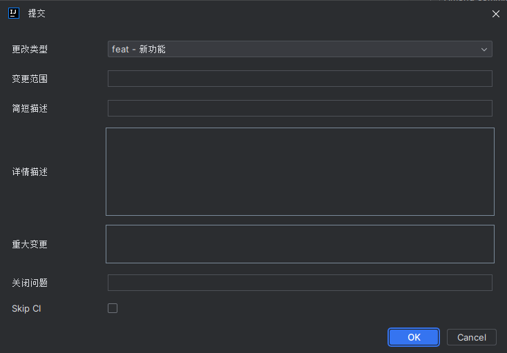

# Git Commit Message Tool

## Description

This is a simple tool to help you write better commit messages. It will guide you through the process of writing a commit message and will help you to follow the best practices.

